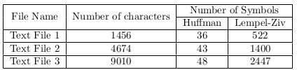
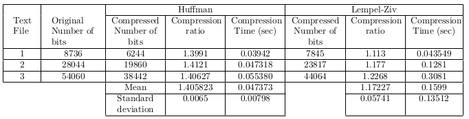
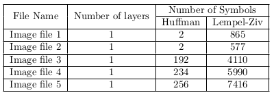
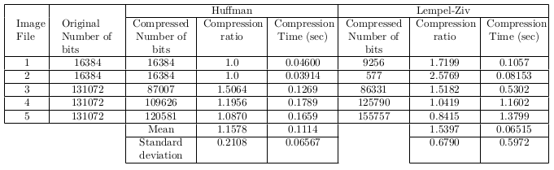

# Digital_Communication_Course
Digital Communication Course's Assignments

## HW1
This Homework is about Huffman coding and Lempel-Ziv coding implementation on Matlab. My implementation are in `MyHuffman.m` and `MyLempelZiv.m` files. In `Q1.m` and `Q2.m` some tests are performed. To test Huffman coding, I also used matlab Huffmand function to check results. `./HW1/file` directoy contains some images and text files that are encoded using my functions and I calculated compression rate. The results are as below:

### Text files coding results
These are text file symbols and compression rate. As you can see for texts using Huffman is better than Lempel-Ziv coding. However, we need to send dictionary to the decoder in order to decode symbols in receiver. But, Lempel-Ziv doesn't need any dictionary and the only thing that both encoder and decoder must agree on is codewrod length.

|  |
| ----------------------------------------- |
|  |

### Images coding results
In contrast to text files, in some cases, Lempel-Ziv performs better than Huffman - in terms of compression ratio. The performance totally dependes on image's content. For instance if the number of image's symbols are small, Lempel-Ziv can perform better. Howerver, Lempel-Ziv is quite slow compared to Huffman but, as I mentioned before, it doesn't need any dictionary.

|  |
| ----------------------------------------- |
|  |
